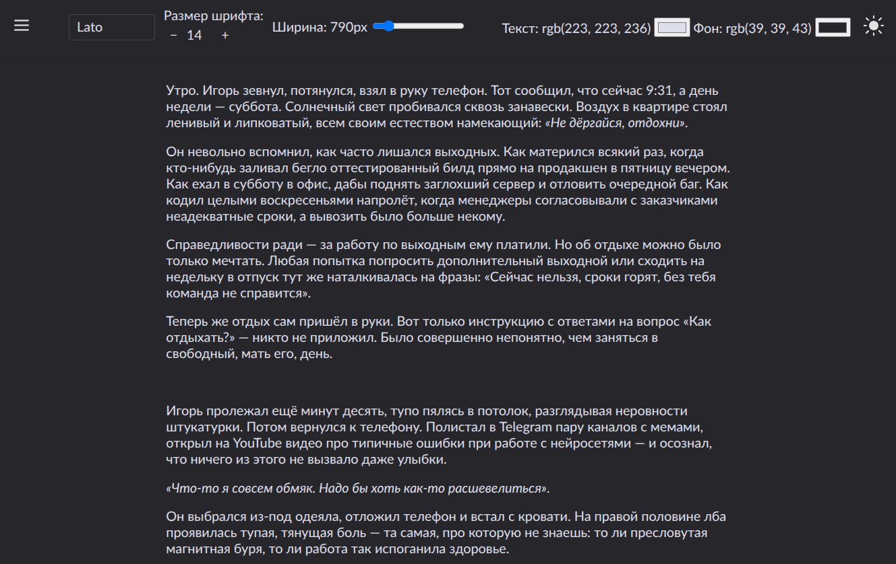

# 📖 LitOverlay

**LitOverlay** — это современный, полностью настраиваемый веб-ридер для литературных текстов с мультимедийной поддержкой. Проект объединяет атмосферный текст, аудио и изображения в едином, персонализируемом интерфейсе, разработанном с учётом потребностей читателей, включая стримеров, которые легко теряют место в повествовании.



## ✨ Особенности

- **Мультимедийная синхронизация**: аудио и изображения встраиваются в текст по правилам из JSON.
- **Адаптивный кастомный аудиоплеер**:
  - Единообразный вид во всех браузерах.
  - Поддержка светлой и тёмной тем.
  - Без кнопки скачивания.
  - Отображение названия трека.
- **Глубокая персонализация**:
  - Выбор гарнитуры шрифта (с предпросмотром).
  - Настройка размера шрифта и ширины текста.
  - Свободный выбор цвета текста и фона.
  - Пресеты «Светлая» и «Тёмная» темы.
- **Удобство для стримеров**:
  - Клик по любому блоку текста → подсветка с адаптивным цветом.
  - Повторный клик → снятие подсветки.
  - Автоматическое снятие при переходе между главами.
- **Навигация**:
  - Плавное боковое меню со списком глав.
  - Кнопки «Предыдущая/Следующая глава» с адаптивным выравниванием.
- **Технологии**:
  - Полностью статический сайт (SSG) → быстрая загрузка, без сервера.
  - Работает на GitHub Pages / GitLab Pages.
  - Чистый, кроссбраузерный CSS без фреймворков.

## 🛠️ Технический стек

- **Фронтенд**: [SvelteKit](https://kit.svelte.dev/) (SSG)
- **Стили**: CSS с переменными, поддержка тем
- **Медиа**: кастомный аудиоплеер на чистом Svelte
- **Хостинг**: GitHub Pages / GitLab Pages
- **Язык**: TypeScript + Svelte

## 📁 Структура проекта

```
LitOverlay/
├── src/
│   ├── lib/
│   │   ├── components/      # Кастомные компоненты (плеер, меню, настройки)
│   │   ├── data/            # Главы (01.html, 02.html, ...) и media-rules.json
│   │   ├── stores/          # Глобальное состояние (тема, настройки, подсветка)
│   │   └── utils/           # Утилиты (парсинг глав, цвета, работа с медиа)
│   ├── routes/
│   │   ├── chapter/[slug]/  # Страница главы
│   │   └── +page.svelte     # Главная страница
│   └── app.html             # Корневой HTML
├── static/
│   ├── icons/               # SVG-иконки (sun, moon, menu, play и т.д.)
│   ├── media/               # Аудио и изображения
│   └── fonts/               # WOFF2-шрифты
└── package.json
```

## 🚀 Быстрый старт

1. **Клонируй репозиторий**
   ```bash
   git clone https://github.com/Greek-Salad/LitOverlay.git
   cd LitOverlay
   ```

2. **Установи зависимости**
   ```bash
   npm install
   ```

3. **Добавь контент**
   - Положи HTML-файлы глав в `src/lib/data/chapters/` (имена: `01.html`, `02.html`, ...)
   - Добавь медиа в `static/media/`
   - Настрой правила в `src/lib/data/media-rules.json`
   - (Опционально) добавь шрифты в `static/fonts/`

4. **Запусти локально**
   ```bash
   npm run dev
   ```
   Открой `http://localhost:5173`

5. **Собери для продакшена**
   ```bash
   npm run build
   ```

## 🌐 Публикация

### GitHub Pages
1. Убедись, что в `svelte.config.js` указан `adapter-static`.
2. Добавь workflow `.github/workflows/deploy.yml` (пример в документации SvelteKit).
3. Push в `main` → сайт автоматически опубликуется на `https://Greek-Salad.github.io/LitOverlay/`.

### GitLab Pages
1. Убедись, что `.gitlab-ci.yml` настроен (пример в документации).
2. Push в `main` → сайт будет доступен по `https://Greek-Salad.gitlab.io/LitOverlay/`.

## 🎨 Настройка медиа

Формат `media-rules.json`:
```json
{
  "media": [
    {
      "src": ["/media/audio/track.mp3"],
      "chapter": 1,
      "before": "Текст, с которого начинается параграф",
      "title": "Название трека"
    },
    {
      "src": ["/media/images/art1.png", "/media/images/art2.png"],
      "chapter": 5,
      "after": "Текст в конце параграфа"
    }
  ]
}
```
Подстрока (`before`/`after`) может быть **любой частью текста** в параграфе.

## 📜 Лицензия

Проект распространяется под MIT License — свободно используй, модифицируй и делись.

---

> 💡 **Совет для стримеров**: используй подсветку (`ЛКМ по абзацу`), чтобы никогда не терять место в тексте во время общения с чатом!

Разработано с ❤️ для ценителей литературы и атмосферного повествования.